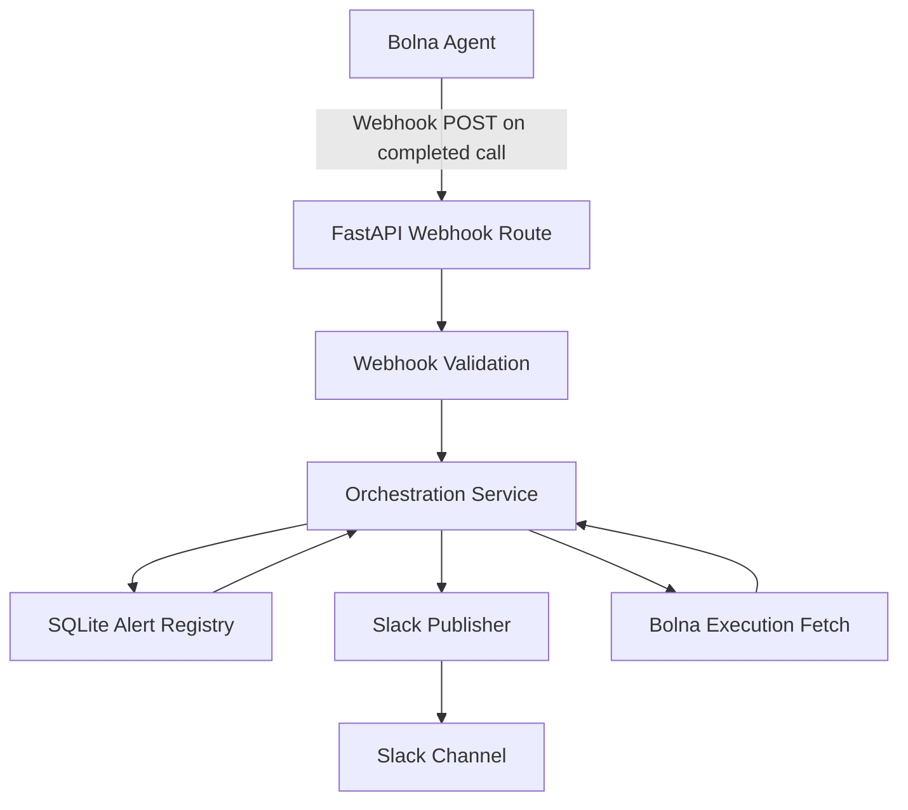

# Bolna Slack Alert Integration

This project implements a FastAPI webhook service that sends a Slack alert whenever a Bolna call ends with `status=completed`.

The Slack alert includes:
- `id`
- `agent_id`
- `duration`
- `transcript`

## Architecture

The service is intentionally small and single-process:

- `app/main.py`
  FastAPI app, routes, startup, and webhook entrypoint.
- `app/service.py`
  Core orchestration for deduplication, Slack posting, retry handling, and transcript recovery.
- `app/registry.py`
  SQLite-backed alert registry keyed by Bolna execution ID.
- `app/slack.py`
  Slack API integration using `chat.postMessage` and `chat.update`.
- `app/bolna.py`
  Bolna execution lookup for transcript recovery.
- `app/config.py`
  Environment-based configuration with startup validation.

Flow:
1. Bolna sends a webhook when call status changes.
2. The app ignores non-`completed` events.
3. The app deduplicates by execution ID.
4. The app posts a Slack alert.
5. If transcript is missing, the app performs one Bolna recovery fetch and updates the Slack message if transcript becomes available.



## Requirements

- Python `3.12+`
- `uv`
- `ngrok`
- Slack workspace access to create/install a bot app
- Bolna account with an agent and API key

## Environment Setup

This repository includes `.env.example`. 

Required variables:

```env
SLACK_BOT_TOKEN=xoxb-...
SLACK_CHANNEL_ID=C...
BOLNA_WEBHOOK_SECRET=some-shared-secret
BOLNA_API_KEY=bn-...
```

Optional/defaulted variables:

```env
BOLNA_API_BASE_URL=https://api.bolna.ai
SQLITE_PATH=alerts.db
SLACK_MAX_RETRIES=3
SLACK_RETRY_BACKOFF_SECONDS=0.5
PROCESSING_CLAIM_TIMEOUT_SECONDS=60
TRANSCRIPT_MAX_CHARS=3000
```

## Local Setup

Create the environment file:

```bash
cp .env.example .env
```

Install dependencies:

```bash
uv sync --dev
```

This creates a local virtual environment in `.venv/`.

Optional activation:

```bash
source .venv/bin/activate
```

Run the service:

```bash
uv run uvicorn app.main:app --host 0.0.0.0 --port 8000
```

Health check:

```bash
curl http://127.0.0.1:8000/health
```

Expected response:

```json
{"status":"ok"}
```

## Slack Setup

1. Create a Slack app.
2. Enable a bot user in `App Home`.
3. Add bot scope `chat:write` in `OAuth & Permissions`.
4. Install the app to the workspace.
5. Copy the `Bot User OAuth Token` into `SLACK_BOT_TOKEN`.
6. Invite the bot to the target channel.
7. Copy the channel ID into `SLACK_CHANNEL_ID`.

## Bolna Setup

1. Create or reuse a Bolna agent. The provided template agent can be reused:
   `d311e737-70e6-4075-bef6-c0ef3a7026b4`
2. Generate a Bolna API key and put it into `BOLNA_API_KEY`.
3. Open the agent’s `Analytics` tab.
4. In `Push all execution data to webhook`, paste the public webhook URL.

## Ngrok Setup

Start the local app first, then expose it publicly:

```bash
ngrok http 8000
```

If ngrok gives:

```text
https://<your-domain>.ngrok-free.dev
```

then configure Bolna with:

```text
https://<your-domain>.ngrok-free.dev/webhooks/bolna/calls?webhook_secret=<your-secret>
```

Bolna docs describe URL-based webhook configuration. Because custom headers are not documented there, this app accepts the webhook secret in either:
- `X-Bolna-Webhook-Secret` header
- `webhook_secret` query parameter

## Manual Verification

Test a completed-call webhook locally:

```bash
curl -X POST 'http://127.0.0.1:8000/webhooks/bolna/calls?webhook_secret=replace-with-secret' \
  -H 'Content-Type: application/json' \
  --data @examples/bolna-completed-webhook.json
```

Expected response shape:

```json
{"status":"processed","execution_id":"...","transcript_recovered":false,"request_id":"..."}
```

Inspect persisted alert state:

```bash
curl http://127.0.0.1:8000/alerts/<execution-id>
```

List recent alerts:

```bash
curl http://127.0.0.1:8000/alerts
```

## Tests

Run the automated test suite:

```bash
uv run pytest
```

## Notes for Evaluators

- Replace `.env` values with your own Slack and Bolna credentials if desired.
- The service is built for real Slack and Bolna APIs, not a mock-only demo.
- Deduplication is persisted in SQLite, so repeated webhook deliveries for the same execution ID do not create duplicate Slack alerts.
